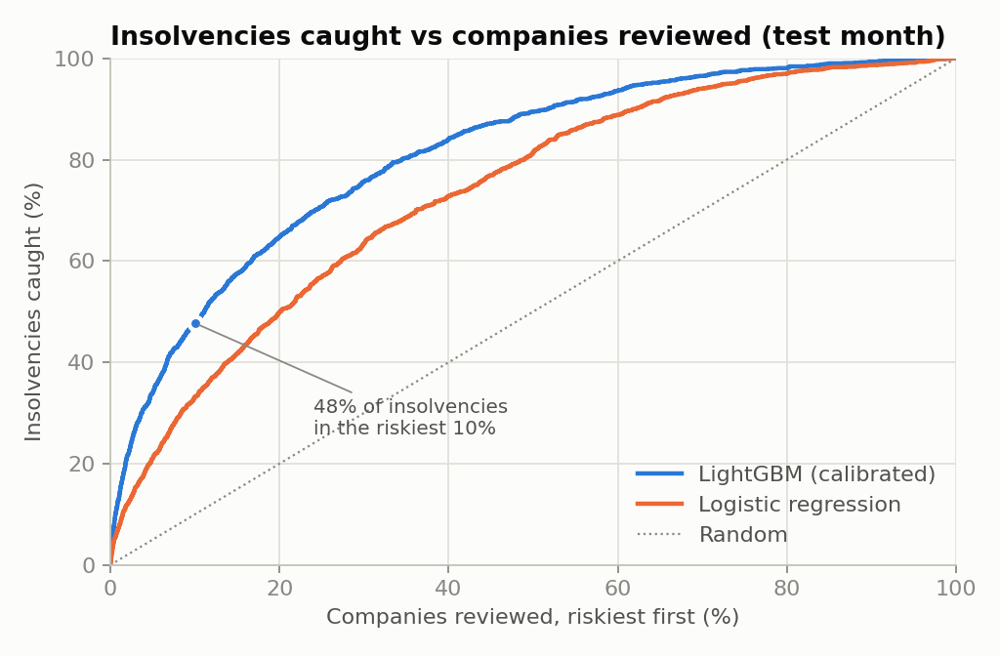
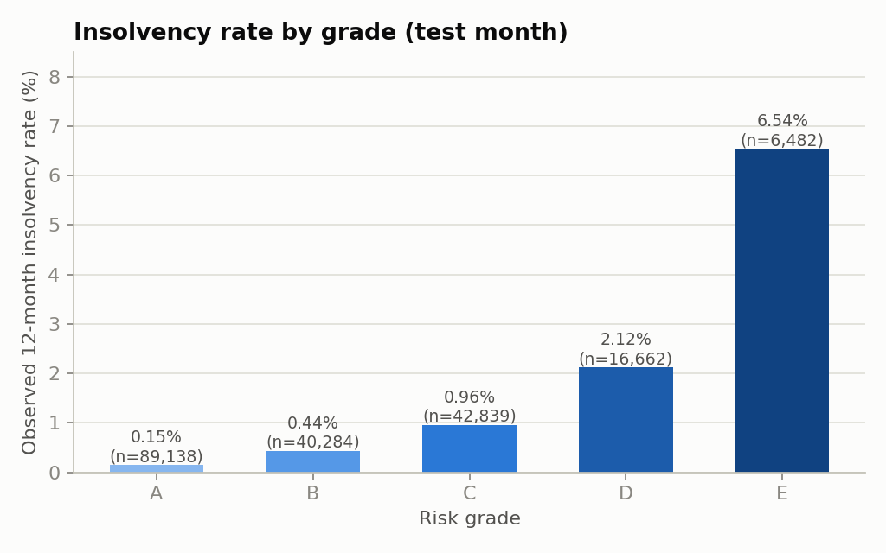
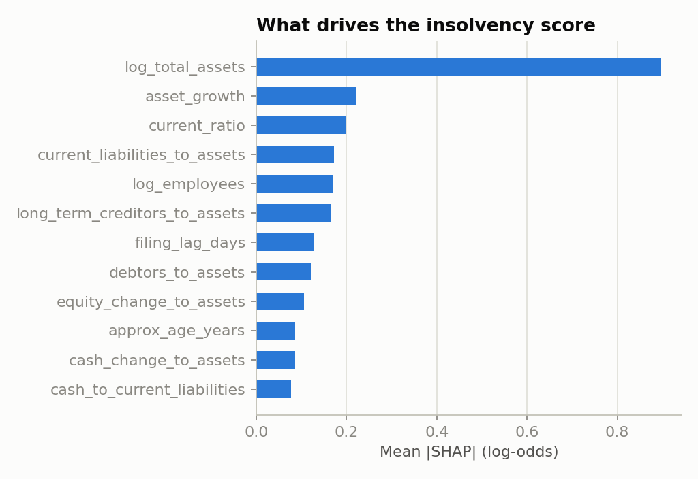
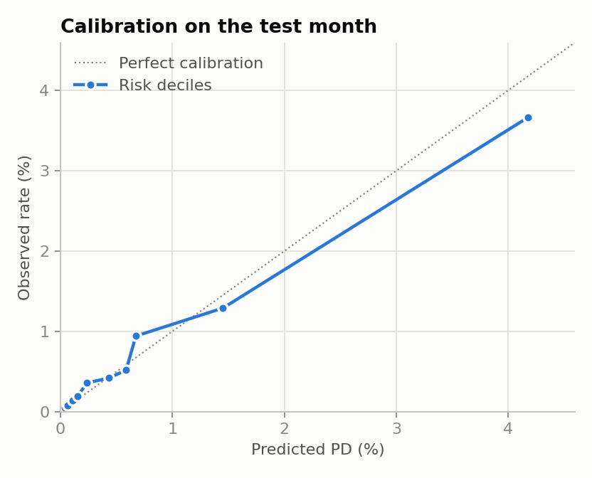

# UK SME Distress Monitor

**An early-warning model for UK company insolvency, built end to end from Companies House's public filings.**

Every UK company files accounts at Companies House, and about three-quarters of them are filed as machine-readable
inline XBRL. This project parses those filings into balance-sheet features and labels each company with what
actually happened to it over the next 12 months. On that data it trains a model that ranks companies by their
risk of entering formal insolvency. A GitHub Action scores the newest filings every weekday and publishes a
watchlist to a Streamlit dashboard.

[](https://github.com/Jimit27/uk-sme-distress-monitor/actions/workflows/ci.yml)
[](https://github.com/Jimit27/uk-sme-distress-monitor/actions/workflows/daily-score.yml)

## Results (real data, out-of-time test)

The model is trained on **208,196** trading companies that filed accounts in July 2025. It is tested on
**195,405 different companies** that filed in August 2025. Outcomes come from the full register snapshot of
1 September 2026 (5,689,367 live companies).

| Model (insolvency within ~12 months) | ROC AUC (95% CI) | Gini | Insolvencies caught in riskiest 10% | Lift in riskiest 1% |
|---|---|---|---|---|
| Rule of thumb: negative equity | 0.520 | 0.04 | 14.5% | 0.7x |
| Logistic regression | 0.736 (0.726 to 0.749) | 0.47 | 33.1% | 7.4x |
| **LightGBM, monotone and calibrated** | **0.812 (0.802 to 0.822)** | **0.62** | **47.9%** | **13.9x** |

The base rate is 0.77% (1,496 insolvencies in the test month). The predicted average PD is 0.79%, so the model
is calibrated to the observed rate.

| Grade | Companies | Observed insolvency rate | Mean predicted PD |
|---|---|---|---|
| A | 89,138 | 0.15% | 0.10% |
| B | 40,284 | 0.44% | 0.45% |
| C | 42,839 | 0.96% | 0.93% |
| D | 16,662 | 2.12% | 2.79% |
| E | 6,482 | **6.54%** | 6.39% |

Grade E companies go insolvent at **44 times the rate** of grade A companies.

<p>


</p>
<p>


</p>

A second model predicts the broader **failure** outcome: insolvency, a pending strike-off, or the company having
left the register. It reaches a test AUC of 0.777 against a 8.8% base rate, and its grade E companies fail at
40.7%, against 2.4% for grade A.

### Findings

* **Size cuts both ways.** Formal insolvency rises with balance-sheet size, from 0.19% in the smallest fifth
  of companies to 1.29% in the largest. Failure of any kind falls, from 19.8% to 2.6%. Tiny companies rarely
  go through liquidation: they are simply struck off. An insolvency practitioner is appointed when there are
  enough assets and creditors to justify one. This is why the project models the two outcomes separately and
  lets the model learn the direction of each feature from the data.
* **Negative equity alone predicts almost nothing** (AUC 0.52). About 20% of small companies report negative
  net assets, usually because a director's loan funds the business. The signal is in *changes*: assets
  shrinking, liquidity weakening and liabilities rising.
* **Late filing matters.** Companies whose accounts arrived after the statutory deadline became insolvent at
  1.48%, against 0.68% for companies that filed on time.

## How it works

```
Companies House bulk data                  GitHub Actions (build-extract)              dbt + DuckDB                        Python
─────────────────────────                  ─────────────────────────────              ─────────────                       ──────
Monthly accounts archives (iXBRL, ~2 GB) ─► streaming zip reader + lxml   ─► parquet ─► stg_ch__accounts ─┐
Register snapshot (5.7m companies, CSV)  ─► DuckDB CSV → parquet          ─► parquet ─► stg_ch__register ─┤
                                                                                        int_accounts__features (ratios, YoY, filing lag)
                                                                                        int_company_number_age (ASOF join)
                                                                                        fct_training_cohort  (features + 12m labels) ─► LightGBM / logistic
                                                                                        fct_live_filings                             ─► daily scores + SHAP reasons
                                                                                        mart_register_health_by_*                    ─► dashboard
```

* **Parser** ([`src/smewatch/ixbrl.py`](src/smewatch/ixbrl.py)). Filings come from hundreds of accounting
  packages with different namespace prefixes, number formats (`ixt:numcommadecimal`, `fixed-zero`, scale
  and sign attributes) and dimension layouts. The parser resolves XBRL contexts to the current and prior
  balance-sheet dates. It reads creditors through either of the two maturity dimensions used in FRS 102
  filings. A malformed document yields an empty record instead of stopping the run. Tests run it against
  real Companies House filings. **536,815 filings parsed, 100% readable.**
* **Point-in-time design.** Features come only from the accounts themselves. Sector and location come from
  today's register, so they are shown in the dashboard but kept out of the model: companies that dissolved
  are missing from today's register, and that gap would leak the outcome. For the same reason, company age is
  estimated from a neighbouring company number (numbers are issued in sequence) using a DuckDB `ASOF JOIN`,
  never from the company's own record. dbt tests enforce the design: no feature is dated after its filing, no
  label is observed before it, and training and test never share a company.
* **Models** ([`src/smewatch/model/train.py`](src/smewatch/model/train.py)). A logistic regression
  benchmark, plus LightGBM with monotone constraints on the textbook credit relationships (more equity or cash
  means less risk; late filing means more). The LightGBM scores are calibrated with isotonic regression on a
  held-out part of the training month. Hyperparameters were chosen on that validation slice, never on the test
  month.
* **Explanations.** Each score comes with its top three TreeSHAP drivers, written in plain English according
  to the company's actual value (for example "weak short-term liquidity" or "accounts filed after the
  statutory deadline"). An optional hook can rewrite the summary with Claude, using only the facts given.
* **Operations.** `ci.yml` runs ruff, the parser tests, a full dbt build with data tests on fixtures, and
  the model tests. `build-extract.yml` does the heavy ingestion and publishes the extracts as release
  assets. `daily-score.yml` fetches the latest daily accounts every weekday, scores them and commits the
  watchlist.

## Run it

```bash
pip install -e ".[warehouse,app,dev]"
make fetch-extract   # prebuilt extracts from the GitHub release (or `make extract` to rebuild from source, ~5 GB)
make warehouse       # dbt build: models + 20 data tests
make train           # models + reports/metrics.json
make publish figures
make app             # streamlit run app/streamlit_app.py
make test            # pytest: parser on real filings, end-to-end dbt build, model
```

## Repository map

| Path | What it is |
|---|---|
| `src/smewatch/ixbrl.py` | iXBRL / XBRL accounts parser |
| `src/smewatch/ingest/` | resumable downloads, parallel zip parsing, register CSV loader |
| `dbt/models/` | staging, features, labelled cohort and register marts; `dbt/tests/` holds the point-in-time guards |
| `src/smewatch/model/` | training, metrics, scoring, reason codes |
| `app/streamlit_app.py` | dashboard: watchlist, company view, model performance, register health |
| `.github/workflows/` | CI, heavy extract, weekday scoring |
| `reports/` | metrics, figures, [model card](reports/model_card.md) |

## Limitations

* About 75% of accounts are filed electronically, and paper filers are missing. Micro-entity accounts carry
  few figures (cash is reported by only about 40% of filers), and most small companies file no profit and
  loss account.
* The outcome is read from a single snapshot, so the horizon is about 12.5 months for the test month and
  about 13.5 months for the training month.
* A company that went through a fast liquidation *and* dissolved within the window appears as "removed". It
  counts towards failure but not insolvency, which slightly understates the insolvency label.
* There is one test month so far. Each monthly snapshot the pipeline ingests adds another out-of-time
  cohort, so a real backtest series builds up over time.
* A score is a statistical signal about groups of companies, not a credit decision about one of them.

Data: Companies House Free Company Data Product and Accounts Data Product, used under the
[Open Government Licence v3.0](https://www.nationalarchives.gov.uk/doc/open-government-licence/version/3/).
